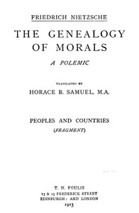

# The Genealogy of Morals: The Complete Works, Volume Thirteen, edited by Dr. Oscar Levy. <kbd>v2.3.0</kbd>

## Authors

 - Nietzsche, Friedrich Wilhelm <small>(1844 - 1900)</small>

## Translators

 - Samuel, Horace Barnett <small>(1883 - 1950)</small>
 - Kennedy, J. M. (John McFarland) <small>(-1 - -1)</small>

## Subjects

 - Ethics

## Readablility

 - **A1:** 72%
 - **A2:** 78%
 - **B1:** 84%
 - **B2:** 91%
 - **C1:** 96%
 - **C2:** 100%

## Words Count

 - **A1:** 477
 - **A2:** 417
 - **B1:** 719
 - **B2:** 1055
 - **C1:** 1282
 - **C2:** 1063

## Source

<kbd>GUTHENBURGE:52319</kbd>
