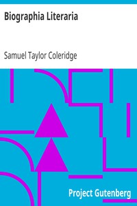

# Biographia Literaria <kbd>v2.3.0</kbd>

## Authors

 - Coleridge, Samuel Taylor <small>(1772 - 1834)</small>

## Translators

## Subjects

 - Aesthetics
 - Criticism
 - Poetry
 - Wordsworth, William, 1770-1850. Lyrical ballads

## Readablility

 - **A1:** 73%
 - **A2:** 79%
 - **B1:** 85%
 - **B2:** 92%
 - **C1:** 97%
 - **C2:** 100%

## Words Count

 - **A1:** 495
 - **A2:** 488
 - **B1:** 940
 - **B2:** 1649
 - **C1:** 2352
 - **C2:** 1937

## Source

<kbd>GUTHENBURGE:6081</kbd>
