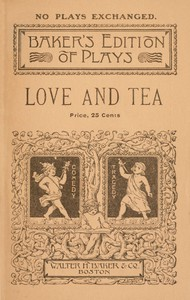

# Love and tea: A comedy-drama of colonial times in two acts <kbd>v2.2.1</kbd>

## Authors

 - See, Anna Phillips <small>(-1 - -1)</small>

## Translators

## Subjects

## Readablility

 - **A1:** 71%
 - **A2:** 78%
 - **B1:** 86%
 - **B2:** 92%
 - **C1:** 98%
 - **C2:** 100%

## Words Count

 - **A1:** 397
 - **A2:** 244
 - **B1:** 304
 - **B2:** 385
 - **C1:** 291
 - **C2:** 118

## Source

<kbd>GUTHENBURGE:68194</kbd>
