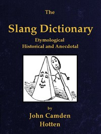

# The Slang Dictionary: Etymological, Historical and Andecdotal <kbd>v2.3.0</kbd>

## Authors

 - Hotten, John Camden <small>(1832 - 1873)</small>

## Translators

## Subjects

 - English language
 - English language
 - London (England)

## Readablility

 - **A1:** 70%
 - **A2:** 76%
 - **B1:** 82%
 - **B2:** 88%
 - **C1:** 94%
 - **C2:** 99%

## Words Count

 - **A1:** 494
 - **A2:** 490
 - **B1:** 917
 - **B2:** 1571
 - **C1:** 2403
 - **C2:** 2597

## Source

<kbd>GUTHENBURGE:42108</kbd>
