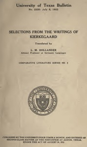

# Selections from the Writings of Kierkegaard <kbd>v2.2.1</kbd>

## Authors

 - Kierkegaard, Søren <small>(1813 - 1855)</small>

## Translators

 - Hollander, Lee M. (Lee Milton) <small>(1880 - 1972)</small>

## Subjects

 - Philosophy
 - Theology

## Readablility

 - **A1:** 77%
 - **A2:** 82%
 - **B1:** 88%
 - **B2:** 94%
 - **C1:** 98%
 - **C2:** 100%

## Words Count

 - **A1:** 490
 - **A2:** 461
 - **B1:** 854
 - **B2:** 1297
 - **C1:** 1564
 - **C2:** 1064

## Source

<kbd>GUTHENBURGE:60333</kbd>
