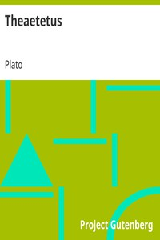

# Theaetetus <kbd>v2.3.0</kbd>

## Authors

 - Plato <small>(-428 - -348)</small>

## Translators

 - Jowett, Benjamin <small>(1817 - 1893)</small>

## Subjects

 - Classical literature
 - Knowledge, Theory of

## Readablility

 - **A1:** 78%
 - **A2:** 84%
 - **B1:** 90%
 - **B2:** 95%
 - **C1:** 99%
 - **C2:** 100%

## Words Count

 - **A1:** 474
 - **A2:** 402
 - **B1:** 682
 - **B2:** 970
 - **C1:** 940
 - **C2:** 508

## Source

<kbd>GUTHENBURGE:1726</kbd>
