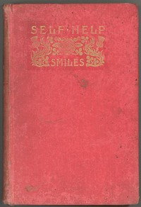

# Self Help; with Illustrations of Conduct and Perseverance <kbd>v2.2.1</kbd>

## Authors

 - Smiles, Samuel <small>(1812 - 1904)</small>

## Translators

## Subjects

 - Conduct of life

## Readablility

 - **A1:** 73%
 - **A2:** 79%
 - **B1:** 86%
 - **B2:** 92%
 - **C1:** 97%
 - **C2:** 100%

## Words Count

 - **A1:** 494
 - **A2:** 493
 - **B1:** 949
 - **B2:** 1646
 - **C1:** 2256
 - **C2:** 1648

## Source

<kbd>GUTHENBURGE:935</kbd>
