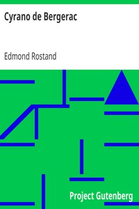

# Cyrano de Bergerac <kbd>v2.3.0</kbd>

## Authors

 - Rostand, Edmond <small>(1868 - 1918)</small>

## Translators

 - Guillemard, Mary F. <small>(-1 - -1)</small>
 - Thomas, Gladys <small>(-1 - -1)</small>

## Subjects

 - Authors, French
 - Cyrano de Bergerac, 1619-1655
 - France

## Readablility

 - **A1:** 73%
 - **A2:** 80%
 - **B1:** 86%
 - **B2:** 91%
 - **C1:** 97%
 - **C2:** 100%

## Words Count

 - **A1:** 475
 - **A2:** 387
 - **B1:** 628
 - **B2:** 834
 - **C1:** 899
 - **C2:** 638

## Source

<kbd>GUTHENBURGE:1254</kbd>
