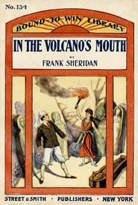

# In the volcano's mouth; or, A boy against an army <kbd>v2.3.0</kbd>

## Authors

 - Sheridan, Frank <small>(-1 - -1)</small>

## Translators

## Subjects

 - Adventure stories
 - Dime novels

## Readablility

 - **A1:** 76%
 - **A2:** 82%
 - **B1:** 88%
 - **B2:** 93%
 - **C1:** 98%
 - **C2:** 100%

## Words Count

 - **A1:** 493
 - **A2:** 443
 - **B1:** 777
 - **B2:** 1093
 - **C1:** 1057
 - **C2:** 599

## Source

<kbd>GUTHENBURGE:68164</kbd>
