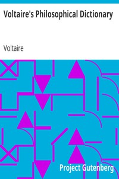

# Voltaire's Philosophical Dictionary <kbd>v2.2.1</kbd>

## Authors

 - Voltaire <small>(1694 - 1778)</small>

## Translators

## Subjects

 - Philosophy

## Readablility

 - **A1:** 77%
 - **A2:** 82%
 - **B1:** 88%
 - **B2:** 93%
 - **C1:** 98%
 - **C2:** 100%

## Words Count

 - **A1:** 490
 - **A2:** 461
 - **B1:** 839
 - **B2:** 1271
 - **C1:** 1495
 - **C2:** 1127

## Source

<kbd>GUTHENBURGE:18569</kbd>
