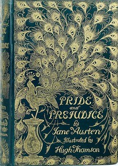

# Pride and Prejudice <kbd>v2.3.0</kbd>

## Authors

 - Austen, Jane <small>(1775 - 1817)</small>

## Translators

## Subjects

 - Courtship
 - Domestic fiction
 - England
 - Love stories
 - Sisters
 - Social classes
 - Young women

## Readablility

 - **A1:** 79%
 - **A2:** 85%
 - **B1:** 91%
 - **B2:** 96%
 - **C1:** 99%
 - **C2:** 100%

## Words Count

 - **A1:** 487
 - **A2:** 459
 - **B1:** 801
 - **B2:** 1183
 - **C1:** 1336
 - **C2:** 755

## Source

<kbd>GUTHENBURGE:1342</kbd>
