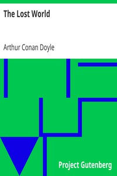

# The Lost World <kbd>v2.3.0</kbd>

## Authors

 - Doyle, Arthur Conan <small>(1859 - 1930)</small>

## Translators

## Subjects

 - Challenger, Professor (Fictitious character)
 - Dinosaurs
 - Fantasy fiction
 - Prehistoric peoples
 - South America

## Readablility

 - **A1:** 76%
 - **A2:** 82%
 - **B1:** 88%
 - **B2:** 93%
 - **C1:** 97%
 - **C2:** 100%

## Words Count

 - **A1:** 490
 - **A2:** 467
 - **B1:** 865
 - **B2:** 1345
 - **C1:** 1580
 - **C2:** 1124

## Source

<kbd>GUTHENBURGE:139</kbd>
