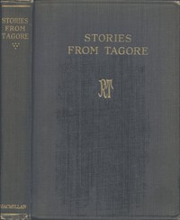

# Stories from Tagore <kbd>v2.2.1</kbd>

## Authors

 - Tagore, Rabindranath <small>(1861 - 1941)</small>

## Translators

## Subjects

 - English language
 - India
 - Short stories, Bengali
 - Tagore, Rabindranath, 1861-1941

## Readablility

 - **A1:** 77%
 - **A2:** 83%
 - **B1:** 89%
 - **B2:** 94%
 - **C1:** 98%
 - **C2:** 100%

## Words Count

 - **A1:** 490
 - **A2:** 464
 - **B1:** 801
 - **B2:** 1135
 - **C1:** 1122
 - **C2:** 646

## Source

<kbd>GUTHENBURGE:33525</kbd>
