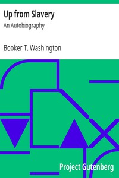

# Up from Slavery: An Autobiography <kbd>v2.3.0</kbd>

## Authors

 - Washington, Booker T. <small>(1856 - 1915)</small>

## Translators

## Subjects

 - African Americans
 - Educators
 - Tuskegee Institute
 - Washington, Booker T., 1856-1915

## Readablility

 - **A1:** 76%
 - **A2:** 83%
 - **B1:** 89%
 - **B2:** 95%
 - **C1:** 99%
 - **C2:** 100%

## Words Count

 - **A1:** 489
 - **A2:** 466
 - **B1:** 823
 - **B2:** 1137
 - **C1:** 1195
 - **C2:** 547

## Source

<kbd>GUTHENBURGE:2376</kbd>
