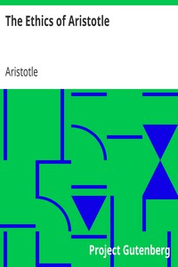

# The Ethics of Aristotle <kbd>v2.0.2</kbd>

## Authors

 - Aristotle <small>(-384 - -322)</small>

## Translators

## Subjects

 - Ethics

## Readablility

 - **A1:** 51%
 - **A2:** 60%
 - **B1:** 72%
 - **B2:** 88%
 - **C1:** 91%
 - **C2:** 100%

## Words Count

 - **A1:** 552
 - **A2:** 521
 - **B1:** 808
 - **B2:** 1248
 - **C1:** 480
 - **C2:** 3301

## Source

<kbd>GUTHENBURGE:8438</kbd>
