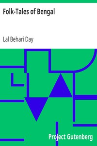

# Folk-Tales of Bengal <kbd>v2.3.0</kbd>

## Authors

 - Day, Lal Behari <small>(1826 - 1894)</small>

## Translators

## Subjects

 - Bengali (South Asian people)
 - Tales

## Readablility

 - **A1:** 77%
 - **A2:** 83%
 - **B1:** 89%
 - **B2:** 94%
 - **C1:** 98%
 - **C2:** 100%

## Words Count

 - **A1:** 486
 - **A2:** 446
 - **B1:** 762
 - **B2:** 1086
 - **C1:** 1052
 - **C2:** 567

## Source

<kbd>GUTHENBURGE:38488</kbd>
