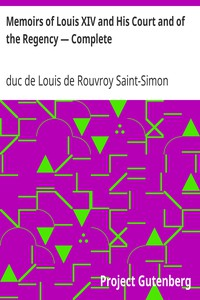

# Memoirs of Louis XIV and His Court and of the Regency — Complete <kbd>v2.2.1</kbd>

## Authors

 - Saint-Simon, Louis de Rouvroy, duc de <small>(1675 - 1755)</small>

## Translators

## Subjects

 - France
 - France
 - France

## Readablility

 - **A1:** 78%
 - **A2:** 83%
 - **B1:** 89%
 - **B2:** 94%
 - **C1:** 98%
 - **C2:** 100%

## Words Count

 - **A1:** 491
 - **A2:** 493
 - **B1:** 966
 - **B2:** 1758
 - **C1:** 2579
 - **C2:** 2044

## Source

<kbd>GUTHENBURGE:3875</kbd>
