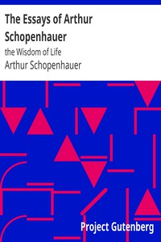

# The Essays of Arthur Schopenhauer: the Wisdom of Life <kbd>v2.2.1</kbd>

## Authors

 - Schopenhauer, Arthur <small>(1788 - 1860)</small>

## Translators

 - Saunders, T. Bailey (Thomas Bailey) <small>(1860 - 1928)</small>

## Subjects

 - Conduct of life
 - Maxims

## Readablility

 - **A1:** 74%
 - **A2:** 80%
 - **B1:** 87%
 - **B2:** 93%
 - **C1:** 98%
 - **C2:** 100%

## Words Count

 - **A1:** 463
 - **A2:** 403
 - **B1:** 658
 - **B2:** 905
 - **C1:** 944
 - **C2:** 567

## Source

<kbd>GUTHENBURGE:10741</kbd>
