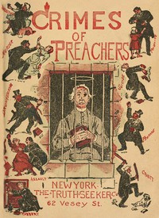

# Crimes of Preachers in the United States and Canada <kbd>v2.3.0</kbd>

## Authors

 - Billings, M. E. <small>(-1 - -1)</small>

## Translators

## Subjects

 - Clergy
 - Clergy
 - Criminals
 - Criminals

## Readablility

 - **A1:** 66%
 - **A2:** 72%
 - **B1:** 76%
 - **B2:** 87%
 - **C1:** 93%
 - **C2:** 99%

## Words Count

 - **A1:** 458
 - **A2:** 385
 - **B1:** 586
 - **B2:** 829
 - **C1:** 928
 - **C2:** 721

## Source

<kbd>GUTHENBURGE:57764</kbd>
