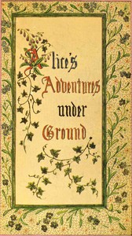

# Alice's Adventures Under Ground: Being a facsimile of the original Ms. book afterwards developed into "Alice's Adventures in Wonderland" <kbd>v2.3.0</kbd>

## Authors

 - Carroll, Lewis <small>(1832 - 1898)</small>

## Translators

## Subjects

 - Alice (Fictitious character from Carroll)
 - Children's stories
 - Fantasy fiction
 - Imaginary places

## Readablility

 - **A1:** 78%
 - **A2:** 84%
 - **B1:** 90%
 - **B2:** 95%
 - **C1:** 98%
 - **C2:** 100%

## Words Count

 - **A1:** 463
 - **A2:** 321
 - **B1:** 431
 - **B2:** 483
 - **C1:** 385
 - **C2:** 144

## Source

<kbd>GUTHENBURGE:19002</kbd>
