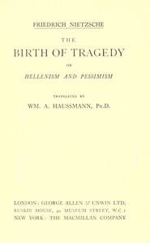

# The Birth of Tragedy; or, Hellenism and Pessimism <kbd>v2.2.1</kbd>

## Authors

 - Nietzsche, Friedrich Wilhelm <small>(1844 - 1900)</small>

## Translators

 - Haussmann, William A. <small>(-1 - -1)</small>

## Subjects

 - Aesthetics
 - Greek drama (Tragedy)
 - Music
 - Mythology, Greek, in literature
 - Tragedy
 - Tragic, The

## Readablility

 - **A1:** 72%
 - **A2:** 77%
 - **B1:** 84%
 - **B2:** 91%
 - **C1:** 96%
 - **C2:** 100%

## Words Count

 - **A1:** 484
 - **A2:** 426
 - **B1:** 708
 - **B2:** 1064
 - **C1:** 1314
 - **C2:** 946

## Source

<kbd>GUTHENBURGE:51356</kbd>
