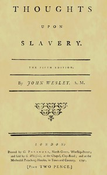

# Thoughts upon slavery <kbd>v2.2.1</kbd>

## Authors

 - Wesley, John <small>(1703 - 1791)</small>

## Translators

## Subjects

 - Slavery

## Readablility

 - **A1:** 73%
 - **A2:** 79%
 - **B1:** 87%
 - **B2:** 93%
 - **C1:** 99%
 - **C2:** 100%

## Words Count

 - **A1:** 423
 - **A2:** 255
 - **B1:** 367
 - **B2:** 445
 - **C1:** 381
 - **C2:** 128

## Source

<kbd>GUTHENBURGE:68144</kbd>
