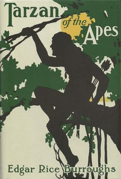

# Tarzan of the Apes <kbd>v2.3.0</kbd>

## Authors

 - Burroughs, Edgar Rice <small>(1875 - 1950)</small>

## Translators

## Subjects

 - Adventure stories
 - Africa
 - British
 - Fantasy fiction
 - Tarzan (Fictitious character)
 - Wild men

## Readablility

 - **A1:** 74%
 - **A2:** 80%
 - **B1:** 87%
 - **B2:** 93%
 - **C1:** 97%
 - **C2:** 100%

## Words Count

 - **A1:** 490
 - **A2:** 464
 - **B1:** 853
 - **B2:** 1297
 - **C1:** 1465
 - **C2:** 1029

## Source

<kbd>GUTHENBURGE:78</kbd>
