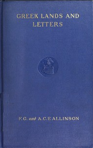

# Greek Lands and Letters <kbd>v2.3.0</kbd>

## Authors

 - Allinson, Anne C. E. (Anne Crosby Emery) <small>(1871 - 1932)</small>
 - Allinson, Francis Greenleaf <small>(1856 - 1931)</small>

## Translators

## Subjects

 - Greece
 - Greek literature

## Readablility

 - **A1:** 73%
 - **A2:** 78%
 - **B1:** 84%
 - **B2:** 90%
 - **C1:** 96%
 - **C2:** 100%

## Words Count

 - **A1:** 494
 - **A2:** 480
 - **B1:** 920
 - **B2:** 1546
 - **C1:** 2164
 - **C2:** 1824

## Source

<kbd>GUTHENBURGE:67984</kbd>
