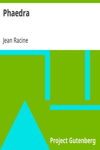

# Phaedra <kbd>v2.2.1</kbd>

## Authors

 - Racine, Jean <small>(1639 - 1699)</small>

## Translators

 - Boswell, Robert Bruce <small>(-1 - -1)</small>

## Subjects

 - Phaedra (Greek mythology)
 - Tragedies

## Readablility

 - **A1:** 73%
 - **A2:** 79%
 - **B1:** 85%
 - **B2:** 93%
 - **C1:** 98%
 - **C2:** 100%

## Words Count

 - **A1:** 430
 - **A2:** 279
 - **B1:** 441
 - **B2:** 615
 - **C1:** 540
 - **C2:** 231

## Source

<kbd>GUTHENBURGE:1977</kbd>
