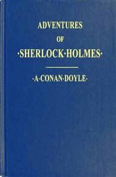

# Adventures of Sherlock Holmes: Illustrated <kbd>v2.0.2</kbd>

## Authors

 - Doyle, Arthur Conan <small>(1859 - 1930)</small>

## Translators

## Subjects

 - Detective and mystery stories, English
 - Holmes, Sherlock (Fictitious character)
 - Private investigators

## Readablility

 - **A1:** 55%
 - **A2:** 63%
 - **B1:** 74%
 - **B2:** 87%
 - **C1:** 90%
 - **C2:** 100%

## Words Count

 - **A1:** 591
 - **A2:** 583
 - **B1:** 1009
 - **B2:** 1509
 - **C1:** 629
 - **C2:** 4105

## Source

<kbd>GUTHENBURGE:48320</kbd>
