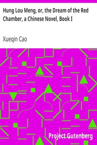

# Hung Lou Meng, or, the Dream of the Red Chamber, a Chinese Novel, Book I <kbd>v2.2.1</kbd>

## Authors

 - Cao, Xueqin <small>(1715 - 1763)</small>

## Translators

 - Joly, H. Bencraft <small>(1857 - 1898)</small>

## Subjects

 - Autobiographical fiction
 - Cao, Xueqin, approximately 1717-1763
 - China
 - Domestic fiction
 - Jia, Baoyu (Fictitious character)

## Readablility

 - **A1:** 77%
 - **A2:** 83%
 - **B1:** 88%
 - **B2:** 93%
 - **C1:** 97%
 - **C2:** 100%

## Words Count

 - **A1:** 490
 - **A2:** 477
 - **B1:** 875
 - **B2:** 1451
 - **C1:** 1896
 - **C2:** 1569

## Source

<kbd>GUTHENBURGE:9603</kbd>
