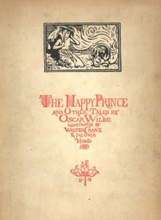

# The Happy Prince, and Other Tales <kbd>v2.0.9</kbd>

## Authors

 - Wilde, Oscar <small>(1854 - 1900)</small>

## Translators

## Subjects

 - Children's stories, English
 - Fairy tales
 - Short stories, English

## Readablility

 - **A1:** 71%
 - **A2:** 78%
 - **B1:** 84%
 - **B2:** 90%
 - **C1:** 92%
 - **C2:** 100%

## Words Count

 - **A1:** 620
 - **A2:** 328
 - **B1:** 412
 - **B2:** 410
 - **C1:** 121
 - **C2:** 781

## Source

<kbd>GUTHENBURGE:902</kbd>
