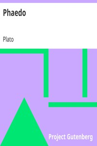

# Phaedo <kbd>v2.2.1</kbd>

## Authors

 - Plato <small>(-428 - -348)</small>

## Translators

 - Jowett, Benjamin <small>(1817 - 1893)</small>

## Subjects

 - Classical literature
 - Immortality (Philosophy)

## Readablility

 - **A1:** 79%
 - **A2:** 84%
 - **B1:** 90%
 - **B2:** 95%
 - **C1:** 99%
 - **C2:** 100%

## Words Count

 - **A1:** 468
 - **A2:** 392
 - **B1:** 626
 - **B2:** 818
 - **C1:** 769
 - **C2:** 358

## Source

<kbd>GUTHENBURGE:1658</kbd>
