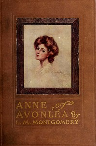

# Anne of Avonlea <kbd>v2.3.0</kbd>

## Authors

 - Montgomery, L. M. (Lucy Maud) <small>(1874 - 1942)</small>

## Translators

## Subjects

 - Canada
 - Islands
 - Orphans
 - Prince Edward Island
 - Shirley, Anne (Fictitious character)
 - Teachers

## Readablility

 - **A1:** 78%
 - **A2:** 84%
 - **B1:** 90%
 - **B2:** 94%
 - **C1:** 98%
 - **C2:** 100%

## Words Count

 - **A1:** 488
 - **A2:** 463
 - **B1:** 845
 - **B2:** 1262
 - **C1:** 1452
 - **C2:** 912

## Source

<kbd>GUTHENBURGE:47</kbd>
