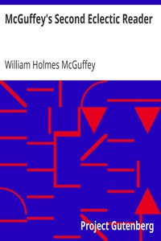

# McGuffey's Second Eclectic Reader <kbd>v2.2.1</kbd>

## Authors

 - McGuffey, William Holmes <small>(1800 - 1873)</small>

## Translators

## Subjects

 - Readers

## Readablility

 - **A1:** 74%
 - **A2:** 81%
 - **B1:** 87%
 - **B2:** 93%
 - **C1:** 97%
 - **C2:** 100%

## Words Count

 - **A1:** 453
 - **A2:** 324
 - **B1:** 437
 - **B2:** 488
 - **C1:** 426
 - **C2:** 256

## Source

<kbd>GUTHENBURGE:14668</kbd>
