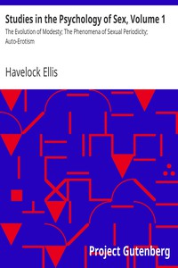

# Studies in the Psychology of Sex, Volume 1: The Evolution of Modesty; The Phenomena of Sexual Periodicity; Auto-Erotism <kbd>v2.2.1</kbd>

## Authors

 - Ellis, Havelock <small>(1859 - 1939)</small>

## Translators

## Subjects

 - Sex
 - Sex (Psychology)

## Readablility

 - **A1:** 70%
 - **A2:** 76%
 - **B1:** 83%
 - **B2:** 89%
 - **C1:** 96%
 - **C2:** 99%

## Words Count

 - **A1:** 491
 - **A2:** 476
 - **B1:** 863
 - **B2:** 1446
 - **C1:** 1855
 - **C2:** 1425

## Source

<kbd>GUTHENBURGE:13610</kbd>
