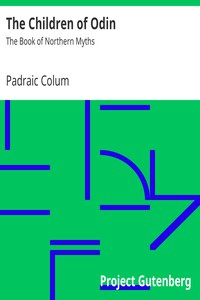

# The Children of Odin: The Book of Northern Myths <kbd>v2.2.1</kbd>

## Authors

 - Colum, Padraic <small>(1881 - 1972)</small>

## Translators

## Subjects

 - Mythology, Norse

## Readablility

 - **A1:** 80%
 - **A2:** 85%
 - **B1:** 90%
 - **B2:** 95%
 - **C1:** 98%
 - **C2:** 100%

## Words Count

 - **A1:** 467
 - **A2:** 373
 - **B1:** 578
 - **B2:** 778
 - **C1:** 755
 - **C2:** 356

## Source

<kbd>GUTHENBURGE:24737</kbd>
