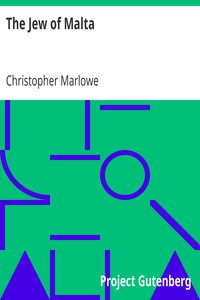

# The Jew of Malta <kbd>v2.3.0</kbd>

## Authors

 - Marlowe, Christopher <small>(1564 - 1593)</small>

## Translators

## Subjects

 - Jews
 - Tragedies

## Readablility

 - **A1:** 77%
 - **A2:** 82%
 - **B1:** 88%
 - **B2:** 93%
 - **C1:** 97%
 - **C2:** 100%

## Words Count

 - **A1:** 467
 - **A2:** 356
 - **B1:** 519
 - **B2:** 649
 - **C1:** 670
 - **C2:** 327

## Source

<kbd>GUTHENBURGE:901</kbd>
