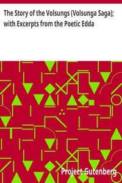

# The Story of the Volsungs (Volsunga Saga); with Excerpts from the Poetic Edda <kbd>v2.3.0</kbd>

## Authors

## Translators

 - Morris, William <small>(1834 - 1896)</small>
 - Eiríkr Magnússon <small>(1833 - 1913)</small>

## Subjects

 - Eddas
 - Nibelungen
 - Sagas
 - Siegfried (Legendary character)

## Readablility

 - **A1:** 78%
 - **A2:** 83%
 - **B1:** 88%
 - **B2:** 93%
 - **C1:** 98%
 - **C2:** 100%

## Words Count

 - **A1:** 477
 - **A2:** 382
 - **B1:** 620
 - **B2:** 809
 - **C1:** 807
 - **C2:** 473

## Source

<kbd>GUTHENBURGE:1152</kbd>
