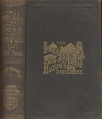

# The Innocents Abroad <kbd>v2.3.0</kbd>

## Authors

 - Twain, Mark <small>(1835 - 1910)</small>

## Translators

## Subjects

 - Europe
 - Middle East
 - Voyages and travels

## Readablility

 - **A1:** 75%
 - **A2:** 80%
 - **B1:** 86%
 - **B2:** 92%
 - **C1:** 97%
 - **C2:** 100%

## Words Count

 - **A1:** 495
 - **A2:** 496
 - **B1:** 974
 - **B2:** 1768
 - **C1:** 2722
 - **C2:** 2348

## Source

<kbd>GUTHENBURGE:3176</kbd>
