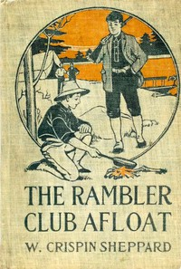

# The Rambler Club Afloat <kbd>v2.2.1</kbd>

## Authors

 - Sheppard, W. Crispin (William Crispin) <small>(1871 - -1)</small>

## Translators

## Subjects

 - Adventure stories
 - Boats and boating
 - Boys
 - Mystery fiction

## Readablility

 - **A1:** 73%
 - **A2:** 80%
 - **B1:** 87%
 - **B2:** 93%
 - **C1:** 98%
 - **C2:** 100%

## Words Count

 - **A1:** 480
 - **A2:** 447
 - **B1:** 771
 - **B2:** 1107
 - **C1:** 1136
 - **C2:** 632

## Source

<kbd>GUTHENBURGE:67989</kbd>
