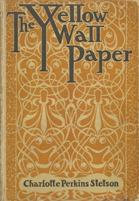

# The Yellow Wallpaper <kbd>v2.1.0</kbd>

## Authors

 - Gilman, Charlotte Perkins <small>(1860 - 1935)</small>

## Translators

## Subjects

 - Feminist fiction
 - Married women
 - Mentally ill women
 - Psychological fiction
 - Sex role

## Readablility

 - **A1:** 71%
 - **A2:** 77%
 - **B1:** 83%
 - **B2:** 89%
 - **C1:** 90%
 - **C2:** 100%

## Words Count

 - **A1:** 492
 - **A2:** 232
 - **B1:** 272
 - **B2:** 239
 - **C1:** 63
 - **C2:** 439

## Source

<kbd>GUTHENBURGE:1952</kbd>
