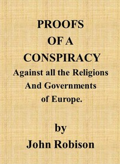

# Proofs of a Conspiracy against all the Religions and Governments of Europe: carried on in the secret meetings of Free Masons, Illuminati, and reading societies. <kbd>v2.3.0</kbd>

## Authors

 - Robison, John <small>(1739 - 1805)</small>

## Translators

## Subjects

 - Freemasonry
 - Illuminati

## Readablility

 - **A1:** 75%
 - **A2:** 80%
 - **B1:** 86%
 - **B2:** 92%
 - **C1:** 97%
 - **C2:** 100%

## Words Count

 - **A1:** 485
 - **A2:** 459
 - **B1:** 825
 - **B2:** 1366
 - **C1:** 1779
 - **C2:** 1218

## Source

<kbd>GUTHENBURGE:47605</kbd>
