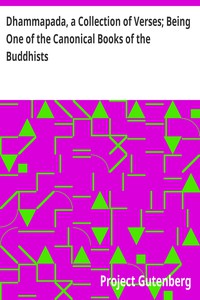

# Dhammapada, a Collection of Verses; Being One of the Canonical Books of the Buddhists <kbd>v2.2.1</kbd>

## Authors

## Translators

 - Müller, F. Max (Friedrich Max) <small>(1823 - 1900)</small>

## Subjects

 - Buddhism
 - Theravada Buddhism

## Readablility

 - **A1:** 72%
 - **A2:** 79%
 - **B1:** 86%
 - **B2:** 93%
 - **C1:** 98%
 - **C2:** 100%

## Words Count

 - **A1:** 389
 - **A2:** 252
 - **B1:** 344
 - **B2:** 425
 - **C1:** 365
 - **C2:** 161

## Source

<kbd>GUTHENBURGE:2017</kbd>
