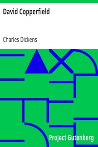

# David Copperfield <kbd>v2.0.9</kbd>

## Authors

 - Dickens, Charles <small>(1812 - 1870)</small>

## Translators

## Subjects

 - Autobiographical fiction
 - Bildungsromans
 - Boys
 - Child labor
 - England
 - Orphans
 - Stepfathers
 - Young men

## Readablility

 - **A1:** 71%
 - **A2:** 76%
 - **B1:** 81%
 - **B2:** 86%
 - **C1:** 87%
 - **C2:** 100%

## Words Count

 - **A1:** 912
 - **A2:** 768
 - **B1:** 1329
 - **B2:** 1929
 - **C1:** 788
 - **C2:** 9398

## Source

<kbd>GUTHENBURGE:766</kbd>
