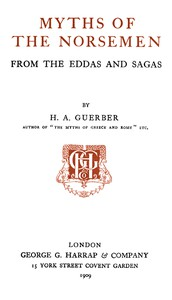

# Myths of the Norsemen: From the Eddas and Sagas <kbd>v2.2.1</kbd>

## Authors

 - Guerber, H. A. (Hélène Adeline) <small>(1859 - 1929)</small>

## Translators

## Subjects

 - Mythology, Norse

## Readablility

 - **A1:** 73%
 - **A2:** 78%
 - **B1:** 85%
 - **B2:** 92%
 - **C1:** 97%
 - **C2:** 100%

## Words Count

 - **A1:** 496
 - **A2:** 474
 - **B1:** 896
 - **B2:** 1491
 - **C1:** 1946
 - **C2:** 1456

## Source

<kbd>GUTHENBURGE:28497</kbd>
