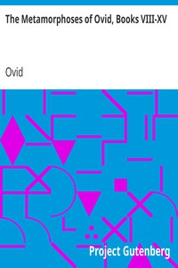

# The Metamorphoses of Ovid, Books VIII-XV <kbd>v2.2.1</kbd>

## Authors

 - Ovid <small>(-43 - 17)</small>

## Translators

 - Riley, Henry T. (Henry Thomas) <small>(1816 - 1878)</small>

## Subjects

 - Classical literature
 - Fables, Latin
 - Latin poetry
 - Metamorphosis
 - Mythology, Classical

## Readablility

 - **A1:** 76%
 - **A2:** 81%
 - **B1:** 87%
 - **B2:** 93%
 - **C1:** 98%
 - **C2:** 100%

## Words Count

 - **A1:** 493
 - **A2:** 469
 - **B1:** 882
 - **B2:** 1441
 - **C1:** 1917
 - **C2:** 1346

## Source

<kbd>GUTHENBURGE:26073</kbd>
