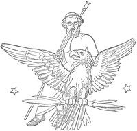

# The Iliad of Homer: Translated into English Blank Verse by William Cowper <kbd>v2.2.1</kbd>

## Authors

 - Homer <small>(-750 - -650)</small>

## Translators

 - Cowper, William <small>(1731 - 1800)</small>

## Subjects

 - Achilles (Mythological character)
 - Epic poetry, Greek
 - Trojan War

## Readablility

 - **A1:** 72%
 - **A2:** 78%
 - **B1:** 84%
 - **B2:** 91%
 - **C1:** 97%
 - **C2:** 100%

## Words Count

 - **A1:** 487
 - **A2:** 459
 - **B1:** 866
 - **B2:** 1450
 - **C1:** 2027
 - **C2:** 1734

## Source

<kbd>GUTHENBURGE:16452</kbd>
