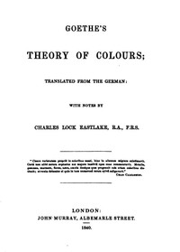

# Goethe's Theory of Colours <kbd>v2.3.0</kbd>

## Authors

 - Goethe, Johann Wolfgang von <small>(1749 - 1832)</small>

## Translators

 - Eastlake, Charles Lock, Sir <small>(1793 - 1865)</small>

## Subjects

 - Color

## Readablility

 - **A1:** 71%
 - **A2:** 78%
 - **B1:** 85%
 - **B2:** 92%
 - **C1:** 97%
 - **C2:** 100%

## Words Count

 - **A1:** 474
 - **A2:** 396
 - **B1:** 670
 - **B2:** 1027
 - **C1:** 1166
 - **C2:** 871

## Source

<kbd>GUTHENBURGE:50572</kbd>
