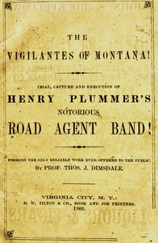

# The vigilantes of Montana; Or, popular justice in the Rocky Mountains: Being a correct and impartial narrative of the chase, trial, capture and execution of Henry Plummer's road agent band, together with accounts of the lives and crimes of many of the robbers and desperadoes, the whole being interspersed with sketches of life in the mining camps of the "Far West" <kbd>v2.3.0</kbd>

## Authors

 - Dimsdale, Thos. J. (Thomas Josiah) <small>(-1 - 1866)</small>

## Translators

## Subjects

 - Criminals
 - Frontier and pioneer life
 - Montana
 - Plummer, Henry Amos, -1864
 - Vigilance committees

## Readablility

 - **A1:** 74%
 - **A2:** 80%
 - **B1:** 87%
 - **B2:** 93%
 - **C1:** 98%
 - **C2:** 100%

## Words Count

 - **A1:** 491
 - **A2:** 478
 - **B1:** 895
 - **B2:** 1413
 - **C1:** 1646
 - **C2:** 1013

## Source

<kbd>GUTHENBURGE:68146</kbd>
