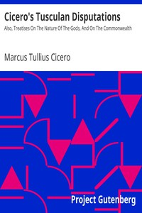

# Cicero's Tusculan Disputations: Also, Treatises On The Nature Of The Gods, And On The Commonwealth <kbd>v2.3.0</kbd>

## Authors

 - Cicero, Marcus Tullius <small>(-106 - -43)</small>

## Translators

 - Yonge, Charles Duke <small>(1812 - 1891)</small>

## Subjects

 - Gods, Roman
 - Happiness
 - Political science
 - Rome
 - State, The
 - Theology

## Readablility

 - **A1:** 77%
 - **A2:** 82%
 - **B1:** 88%
 - **B2:** 94%
 - **C1:** 98%
 - **C2:** 100%

## Words Count

 - **A1:** 487
 - **A2:** 472
 - **B1:** 887
 - **B2:** 1519
 - **C1:** 2047
 - **C2:** 1468

## Source

<kbd>GUTHENBURGE:14988</kbd>
