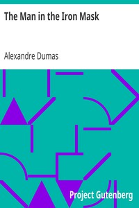

# The Man in the Iron Mask <kbd>v2.2.1</kbd>

## Authors

 - Dumas, Alexandre <small>(1802 - 1870)</small>

## Translators

## Subjects

 - Adventure and adventurers
 - France
 - Historical fiction
 - Man in the Iron Mask
 - Romances
 - Swordsmen

## Readablility

 - **A1:** 78%
 - **A2:** 83%
 - **B1:** 89%
 - **B2:** 94%
 - **C1:** 98%
 - **C2:** 100%

## Words Count

 - **A1:** 493
 - **A2:** 491
 - **B1:** 944
 - **B2:** 1669
 - **C1:** 2187
 - **C2:** 1460

## Source

<kbd>GUTHENBURGE:2759</kbd>
