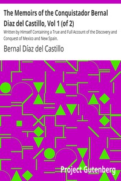

# The Memoirs of the Conquistador Bernal Diaz del Castillo, Vol 1 (of 2): Written by Himself Containing a True and Full Account of the Discovery and Conquest of Mexico and New Spain. <kbd>v2.3.0</kbd>

## Authors

 - Díaz del Castillo, Bernal <small>(1496 - 1584)</small>

## Translators

 - Lockhart, John Ingram <small>(-1 - -1)</small>

## Subjects

 - Mexico

## Readablility

 - **A1:** 77%
 - **A2:** 83%
 - **B1:** 90%
 - **B2:** 95%
 - **C1:** 99%
 - **C2:** 100%

## Words Count

 - **A1:** 489
 - **A2:** 478
 - **B1:** 875
 - **B2:** 1407
 - **C1:** 1678
 - **C2:** 898

## Source

<kbd>GUTHENBURGE:32474</kbd>
