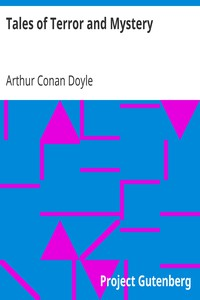

# Tales of Terror and Mystery <kbd>v2.2.1</kbd>

## Authors

 - Doyle, Arthur Conan <small>(1859 - 1930)</small>

## Translators

## Subjects

 - Detective and mystery stories, English
 - Horror tales, English

## Readablility

 - **A1:** 77%
 - **A2:** 82%
 - **B1:** 89%
 - **B2:** 94%
 - **C1:** 98%
 - **C2:** 100%

## Words Count

 - **A1:** 488
 - **A2:** 474
 - **B1:** 867
 - **B2:** 1332
 - **C1:** 1534
 - **C2:** 1002

## Source

<kbd>GUTHENBURGE:537</kbd>
